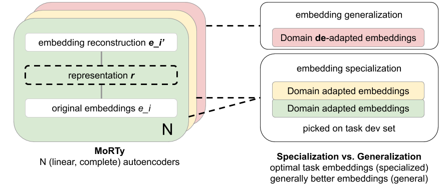

# MoRTy, a simple tool for Zero-shot domain adaptation of embeddings
MoRTy is a simple baseline method for **zero-shot domain adaptation** of embeddings that works especially well for **low-resource** applications, such as when *little pre-traing data is available*. It solves ...

### Problems
In practice, one has to chose which embedding model (FastText, Glove, TransformerX) is optimal for a task. While most pre-training methods like BERT are optimized for *'high-pretraining-resource'* domains, they can not be directly applied to *'low-pre-training resource settings'* and incure substantial training costs. In practice, using a Multi-GPU model to fine tune on a sub 10 MB supervision task can seem counterintuitive and affords preparation and maintanance costs, which limits scalability of future use cases or during deployment.  

# MoRTy:
**M**enu **o**f **r**econstructing **t**ransformations **y**ields domain (*de-*)adapted embeddings

## Recipe:
1. **pre-train**/ download **embeddings** `E_org` (using FastText is recommended for out-of-vocabulary abilities)
2. **Produce** `k` randomly autoencoded/ retro-fitted **versions** `E_r1 ... E_rk` of the original embedding `E_org`
3. **Chose** the **optimal** `E_ro` form the `k` `E_ri` according to:
+ **Embedding specialization**/ *Supervised use case:* a supervised end-task's develoment set (`E_ri` is now essentially a hyperparameter). To save computation, consider selecting the optimal embedding `E_ro` on a low-cost baseline such as logistic regression or FastText and then use the found `E_ro` in the more complex model. Also works to find optimal `E_ro` in multi-input/channel + multi-task settings.
+ **Embedding specialization**/ *Proxy supervised use case:* use the dev/test set of a related (benchmark) task to find optimal embeddings `E_ro`. *'Proxy-shot' setting*.
+ **Embedding generalization**/ *Zero-shot use case:* when training embeddings `E_ri` for 1 epoch on different pre-training corpora sizes (WikiText-2/-103, CommonCrawl) `E_org` we found MoRTy to always produce score improvements (between 1-9%) over the sum of 18 word-embedding benchmark tasks. This means that MoRTy *generalizes* embeddings 'blindly'.

# Properties/ use cases
+ Zero- to few/proxy-shot domain adaptation
+ train in seconds :clock1:
+ low RAM requirements, no GPU needed -- low carbon footprint, MoRTy :hearts: :earth_africa:
+ saves annotation 
+ usable to train simpler models (lower model extension costs/time)
+ cheaply produce that last 5% performance increase for customers :smirk:
+ MoRTy [is not a Muppet](https://en.wikipedia.org/wiki/Morty_Smith) 
